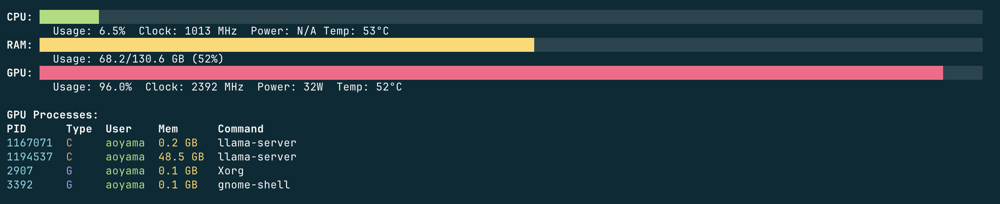
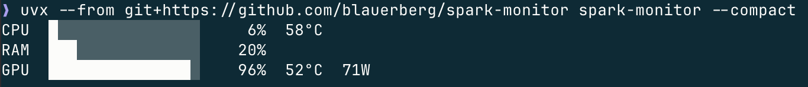

# Spark Monitor

A minimal CLI for monitoring DGX Spark resource usage. Displays only the essential metrics, simply.



## Installation

```bash
git clone https://github.com/blauerberg/spark-monitor.git
cd spark-monitor
uv sync
```

## Usage

```bash
# Default (1-second refresh)
uv run spark-monitor

# Custom refresh interval
uv run spark-monitor --interval 0.5
```

Press `Ctrl+C` to exit.

### Compact mode

Use `--compact` to show only the essential metrics in a minimal 3-line layout.

```bash
uv run spark-monitor --compact
```



## Run directly from GitHub

Without installing:

```bash
uvx --from git+https://github.com/blauerberg/spark-monitor spark-monitor
```

Or install as a persistent command:

```bash
uv tool install git+https://github.com/blauerberg/spark-monitor
spark-monitor
```

To upgrade:

```bash
uv tool upgrade spark-monitor
```

## Display

- **CPU**: usage (bar), clock, temperature, power (N/A)
  - Power is always N/A. The current driver does not expose Grace CPU power.
- **RAM**: usage (bar)
- **GPU**: usage (bar), clock, temperature, power
- **GPU Processes**: processes using the GPU (hidden when none)
